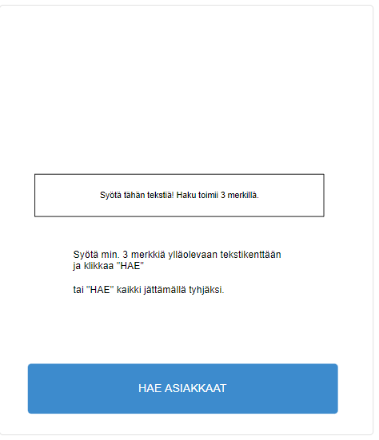
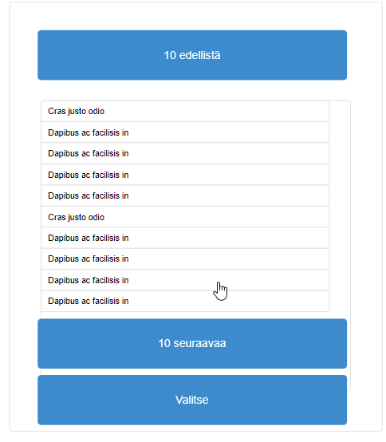
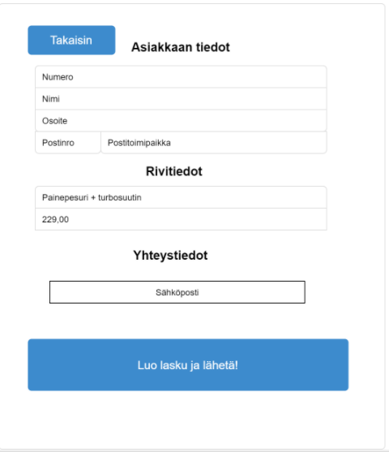

## Toiminnallisuus

Laskun tulostaminen pdf-muotoon tietokantaan tallennetuista asiakastiedoista. 

Tulostuksen pitää toimia puhelimellakin ja nappeihin pitää osua myös pakkasella sormikkaat kädessä. 

## Teknologiat 
* UI esim. React.js + TypeScript 
* API esim. node.js (+TypeScript) 
* DB esim. MongoDB 
* Docker 
* Robotframework automaatiotestaus 

## Työkalut 
* Git 
* Slack

## Käyttöliittymä 

1. Hae asiakkaat
- syötä min. 3 merkkiä tai numeroa, joita käytetään haun parametrina.
tai
- hae kaikki, jos kenttä on tyhjä

2. Valitse listalta asiakas
- näytetään 10
- mahdollisuus kelata listaa ylös ja alas
- valitaan ja jatketaan.

3. Luodaan lasku
- tarkistetaan asiakkaan tiedot
- syötetään rivitieto ja summa
- Näytetään laskuttajan s-postiosoite, johon lasku automaattisesti lähetetään luonnin jälkeen.

4. Näytetään pdf-lasku
- näytetään pdf-lasku käyttöliittymällä, kun se on luotu
- Annetaan mahdollisuus tallentaa pdf laitteelle
- mahdollisuus lähettää se edelleen suoraan puhelimelta käyttäen puhelimen omia toimintoja.

5. Laskun tietojen tallennus

Laskun yksilöivät ja muuttuvat tiedot tallennetaan kantaan json-formaatissa
- aikaleima
- laskunnumero
- viitenumero
- asiakas

## Hallinnointi

API, jolla hallinnoidaan asiakastietoja

1. Asikkaiden tuonti järjestelmään 
- API, jolla voi tuoda 1-n kpl asiakkaita csv/json tiedostona.
2. Asiakastietojen muokkaus
3. Laskuttajan oletustietojen luonti ks. https://laskut.online
- Y-tunnus
- Nimi
- Osoite
- Puhelinnumero
- Sähköposti
4. Laskun perustiedot ks. https://laskut.online
- tilinumero
- laskunnumero 
  - juokseva numero esim. YYMMDDhhmm. Tällä yksilöivällä numerolla lasku löytyy myöhemmin.
- maksuehto 
   - päivien lkm, joka lisätään luontipäivään. Käytetään siis eräpäivän luontiin.
5. Viitteen luonti
- asiakasnro + laskunnro + tarkistussumma
6. pdf laskun luonti
7. Virtuaaliviivakoodin luonti
8. Viivakoodin luonti
9. QR-koodin luonti
10. API laskuttajatietojen oletusarvojen muokkaukseen

## Ei-toiminnalliset vaatimukset

1. Käyttäjän tulee tunnistautua käyttäjätunnuksella ja salasanalla
- alussa 1 käyttäjä riittää
- myös apikey käy tunnistautumiseksi.
3. Asiakastiedot tulee salata levylle kirjoitettaessa esim. MongoDB kannassa.
4. PDF laskuja ei tarvi salata levyllä

